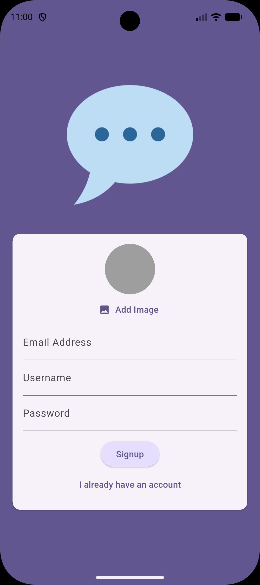
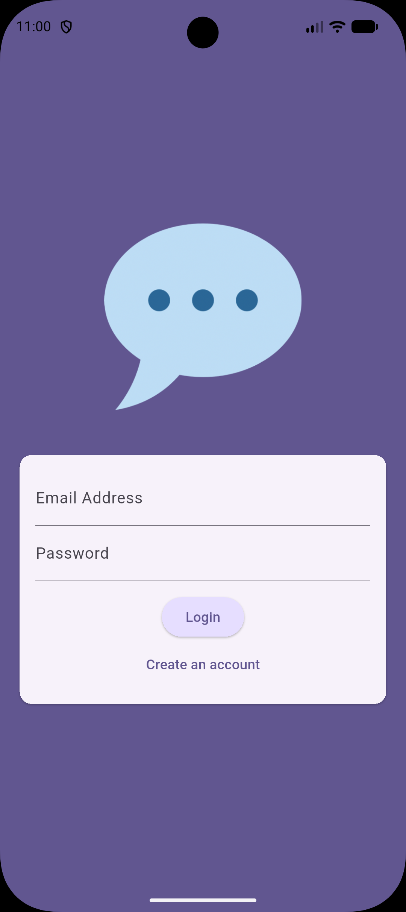
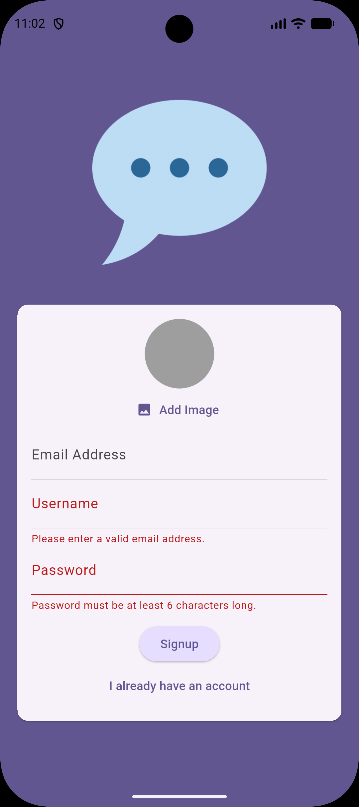
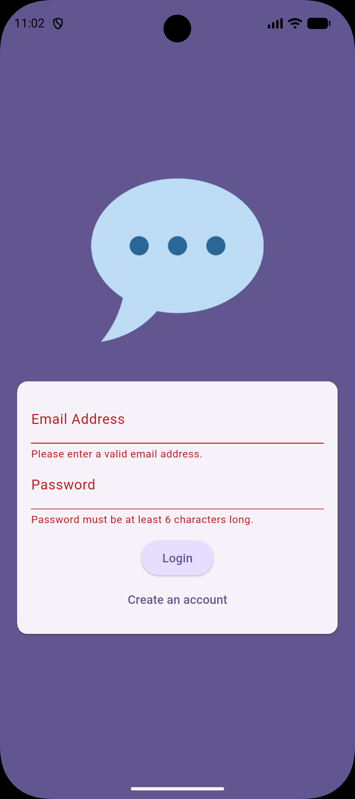
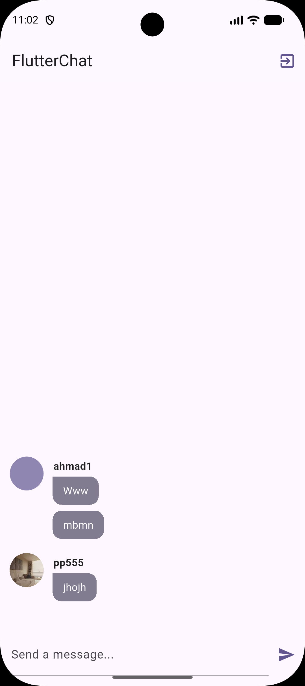

# 💬 Flutter Chat App


A modern **real-time chat application** built using **Flutter** and **Firebase**.
The app demonstrates how to build scalable mobile apps with authentication, cloud storage, push notifications, and real-time messaging.

---

# 🚀 Features

* 🔐 **User Authentication**

  * Sign up and login using Firebase Authentication
  * Email and password validation

* 👤 **User Profiles**

  * Upload profile image during registration
  * Images stored in Firebase Storage

* 💬 **Real-Time Chat**

  * Messages stored in Cloud Firestore
  * Real-time updates using Firestore streams

* 🧑‍🤝‍🧑 **User Identification**

  * Each message shows the sender's username and profile image

* 📱 **Push Notifications**

  * Firebase Cloud Messaging integration

* 🎨 **Modern Chat UI**

  * Chat bubbles
  * Avatar display
  * Clean and responsive design

---

# 📱 Screenshots

<p align="center">
  
  
  
</p>

<p align="center">
  
  
</p>

---

# 🏗 Architecture

```text
Flutter UI
    │
    ▼
Firebase Authentication
    │
    ▼
Cloud Firestore (Real-time messages)
    │
    ▼
Firebase Storage (User images)
    │
    ▼
Firebase Cloud Messaging
```

---

# 🛠 Tech Stack

| Technology              | Usage                       |
| ----------------------- | --------------------------- |
| Flutter                 | Cross-platform UI framework |
| Dart                    | Programming language        |
| Firebase Authentication | User authentication         |
| Cloud Firestore         | Real-time database          |
| Firebase Storage        | Profile images storage      |
| Firebase Messaging      | Push notifications          |

---

# 📦 Packages Used

```
firebase_core
firebase_auth
cloud_firestore
firebase_storage
firebase_messaging
image_picker
```

---

# ⚙️ Installation

### 1️⃣ Clone the repository

```
git clone https://github.com/ahmad007sa/flutter-chat-app.git
```

### 2️⃣ Navigate to the project

```
cd flutter-chat-app
```

### 3️⃣ Install dependencies

```
flutter pub get
```

### 4️⃣ Configure Firebase

Add your Firebase configuration file:

```
android/app/google-services.json
```

### 5️⃣ Run the app

```
flutter run
```

---

# 📊 Application Flow

1. User creates an account
2. Profile image uploaded to Firebase Storage
3. User data stored in Firestore
4. Messages stored in Firestore
5. Messages appear instantly for all users

---

# 🎯 What I Learned

* Building **real-time chat apps with Flutter**
* Integrating **Firebase Authentication**
* Using **Cloud Firestore streams**
* Uploading images using **Firebase Storage**
* Implementing **push notifications**

---

# 👨‍💻 Author

Developed by **Ahmad** as a Flutter learning project.

---

# ⭐ Support

If you like this project, consider giving it a ⭐ on GitHub.

---

# 📄 License

This project is licensed under the MIT License.
